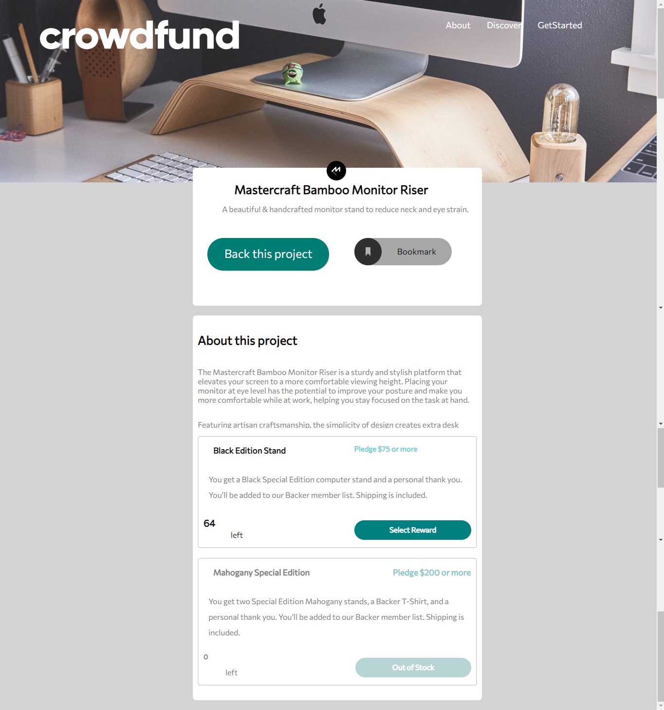
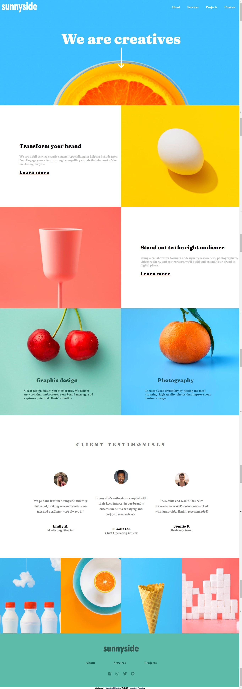
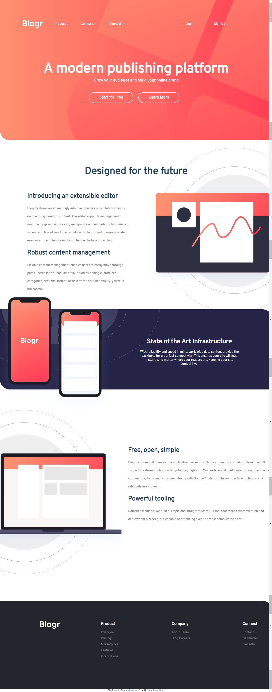

# Oi, Sou Gregório Nagata Doria ! Bem vindo a minha pagina do GitHub !

# Aqui embaixo estão alguns exemplos dos meus projetos

# Site similhante ao Kickstarter:

#Link do repositorio : https://github.com/GregorioNagataDoria/kickstarter-semelhante

#Site feito pelas especificações do FrontendMentor : https://www.frontendmentor.io/challenges

# Site de uma empresa de marketing:

#Link do repositorio : https://github.com/GregorioNagataDoria/site-empresa-design-e-marketing

#Site feito pelas especificações do FrontendMentor : https://www.frontendmentor.io/challenges

# Site de empresa Blogr

#Link do repositorio : https://github.com/GregorioNagataDoria/site-compania-de-marketing-BLOGR-

#Site feito pelas especificações do FrontendMentor : https://www.frontendmentor.io/challenges

# Contato:

 :  (11)981631660  
 :  gregorionagata@gmail.com  
 :   https://www.linkedin.com/in/greg%C3%B3rio-nagata-611007204/

# Linguagens (em ordem de maior experiência até menor):

